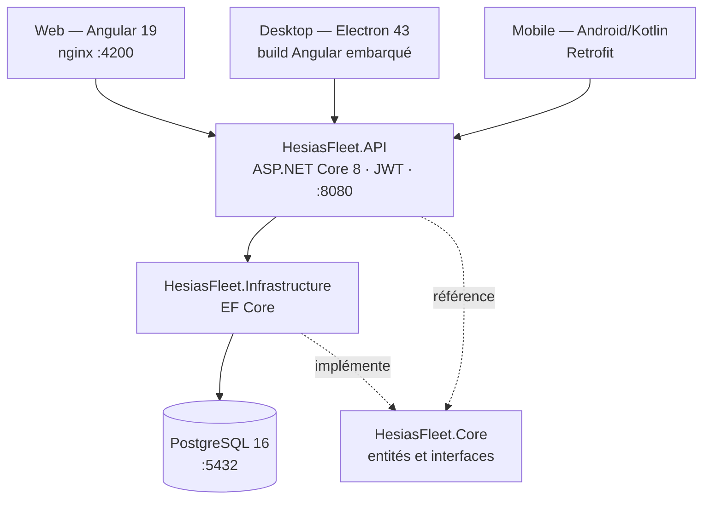

# Hesias Fleet

Solution de gestion de flotte de véhicules pour l'entreprise **Quantum Quotient Labs** : suivi des opérations d'entretien, gestion du magasin de consommables et alertes sur les opérations récurrentes arrivant à échéance.

Le projet se décline en **trois clients** partageant une même API REST :

| Client | Technologie | Usage |
|---|---|---|
| **Web** | Angular 19 + Angular Material | Version complète de gestion, servie par nginx |
| **Desktop** | Electron 43 (encapsule le build Angular) | Version complète en application native Windows |
| **Mobile** | Android natif (Kotlin) | Saisie live sur site par les techniciens |

---

## Table des matières

1. [Architecture](#architecture)
2. [Prérequis](#prérequis)
3. [Démarrage rapide (Docker)](#démarrage-rapide-docker)
4. [Application Web (Angular)](#application-web-angular)
5. [Application Desktop (Electron)](#application-desktop-electron)
6. [Application Mobile (Android)](#application-mobile-android)
7. [Base de données](#base-de-données)
8. [Configuration](#configuration)
9. [Structure du dépôt](#structure-du-dépôt)
10. [Dépannage](#dépannage)

---

## Architecture

L'API est structurée en couches selon une architecture en oignon : `Core` (entités et interfaces métier) ne dépend de rien, `Infrastructure` (EF Core, PostgreSQL) implémente les interfaces de `Core`, et `API` (contrôleurs ASP.NET Core) orchestre l'ensemble.



**Ports utilisés**

| Service | Port | URL |
|---|---|---|
| Web (nginx, via Docker) | `4200` | http://localhost:4200 |
| Web (dev, `ng serve`) | `4200` | http://localhost:4200 |
| API (via Docker) | `8080` | http://localhost:8080/swagger |
| API (dev, `dotnet run`) | `5131` | http://localhost:5131/swagger |
| PostgreSQL | `5432` | `Host=localhost;Port=5432` |

---

## Prérequis

| Outil | Version minimale | Nécessaire pour |
|---|---|---|
| **Docker Desktop** | 4.x (avec Compose v2) | Lancement complet de la solution |
| **.NET SDK** | 8.0 | Développement de l'API hors Docker |
| **Node.js** | 20 LTS | Angular et Electron |
| **npm** | 10 | Angular et Electron |
| **JDK** | 17 | Application Android |
| **Android Studio** | Ladybug ou supérieur | Application Android (SDK 34) |

Vérification rapide :

```bash
docker --version && dotnet --version && node --version && java -version
```

---

## Démarrage rapide (Docker)

C'est la méthode recommandée : elle lance la base, l'API et le front web en une commande.

```bash
cd HesiasFleet
docker compose up --build
```

Au premier démarrage, PostgreSQL exécute automatiquement les scripts de `db/init/` :
`01-schema.sql` crée les 11 tables du modèle (`Vehicles`, `Operations`, `MetaOperations`, `Parts`, `StockEntries`, `StockMovements`, `OperationConsumables`, `OperationSpareParts`, `VehicleProperties`, `Notes`, `Users`) puis `02-seed.sql` insère le jeu de données de démonstration.

Une fois les trois conteneurs démarrés :

- Application web : **http://localhost:4200**
- Documentation de l'API (Swagger) : **http://localhost:8080/swagger**

**Comptes de démonstration**

<!-- À COMPLÉTER : renseigne ici les identifiants créés par 02-seed.sql -->

| Rôle | Email | Mot de passe |
|---|---|---|
| Responsable magasin | `...` | `...` |
| Technicien | `...` | `...` |

**Arrêt**

```bash
docker compose down          # arrête les conteneurs, conserve les données
docker compose down -v       # supprime aussi le volume : la base est réinitialisée au prochain démarrage
```

> Le rejeu des scripts `db/init/` n'a lieu que si le volume `hesias_pgdata` est vide. Pour repartir d'une base propre, il faut donc obligatoirement passer par `down -v`.

---

## Application Web (Angular)

### Développement

```bash
cd HesiasFleet/HesiasFleet.Web
npm install
npm start                    # équivaut à : ng serve hesias-fleet-web
```

L'application est disponible sur http://localhost:4200 avec rechargement à chaud.

L'API doit tourner en parallèle. Deux possibilités :

```bash
# Option A — uniquement la base et l'API dans Docker
cd HesiasFleet && docker compose up db api

# Option B — API en local
cd HesiasFleet/HesiasFleet.API && dotnet run
```

> L'URL de l'API consommée par le front est définie dans `src/environments/`. Assure-toi qu'elle pointe vers le bon port selon l'option retenue : `8080` pour Docker, `5131` pour `dotnet run`.

### Build de production

```bash
npm run build                # sortie : dist/hesias-fleet-web/browser/
```

---

## Application Desktop (Electron)

L'application desktop **n'est pas un projet séparé** : elle réutilise exactement le même code Angular que la version web. Electron sert de conteneur natif et charge le build Angular depuis le système de fichiers.

### Fonctionnement

```
HesiasFleet.Web/
├── electron/
│   ├── main.js        ← processus principal Electron (crée la fenêtre)
│   └── preload.js     ← pont sécurisé entre le processus principal et le rendu
└── dist/hesias-fleet-web/browser/
    └── index.html     ← build Angular chargé par Electron en production
```

Le processus principal distingue deux modes :

| Mode | Ce qui est chargé | Déclencheur |
|---|---|---|
| Développement | `http://localhost:4200` (serveur `ng serve`) | `NODE_ENV=development` |
| Production | `../dist/hesias-fleet-web/browser/index.html` via `file://` | par défaut |

La fenêtre est créée en 1400×900 (minimum 1024×700). Pour des raisons de sécurité, `contextIsolation` est activé et `nodeIntegration` désactivé : le renderer Angular n'a aucun accès direct à Node.js, tout passe par l'API exposée dans `preload.js`. Les liens externes sont ouverts dans le navigateur par défaut du système plutôt que dans la fenêtre de l'application.

### Lancer en développement

```bash
cd HesiasFleet/HesiasFleet.Web
npm install
npm run electron:dev
```

Cette commande enchaîne trois opérations via `concurrently` :

1. démarre `ng serve` sur le port 4200 ;
2. `wait-on` attend que le serveur réponde effectivement ;
3. lance Electron avec `NODE_ENV=development`, qui charge alors `localhost:4200`.

Le rechargement à chaud d'Angular fonctionne dans la fenêtre Electron. En revanche, toute modification de `electron/main.js` ou `electron/preload.js` impose de relancer la commande.

### Packager l'exécutable Windows

```bash
cd HesiasFleet/HesiasFleet.Web
npm run electron:build
```

Cette commande fait deux choses :

1. `ng build hesias-fleet-web --base-href ./` — le `--base-href ./` est **indispensable** : sans lui, Angular génère des chemins absolus (`/main.js`) qui sont introuvables sous le protocole `file://` et l'application s'ouvre sur une fenêtre blanche ;
2. `electron-builder` — empaquette le tout en installeur **NSIS** (`appId` : `fr.quantumquotient.hesiasfleet`, nom du produit : *Hesias Fleet*).

Seuls `electron/**/*` et `dist/hesias-fleet-web/browser/**/*` sont embarqués dans le paquet : le reste du dossier (sources, `node_modules`, configuration) n'est pas distribué.

> **⚠️ Chemin de sortie codé en dur**
>
> `package.json` définit `build.directories.output` à `C:/hesias-build`. L'installeur généré n'atterrit donc **pas** dans le dossier du projet mais à la racine du disque `C:`, et la commande **échoue sur macOS et Linux**.
>
> Pour rendre le build portable, remplace cette valeur par un chemin relatif :
>
> ```json
> "directories": { "output": "release" }
> ```
>
> Le dossier `release/` est déjà couvert par le `.gitignore`.

### Prérequis de fonctionnement

L'application desktop est un client : elle ne contient ni base de données ni serveur. **L'API doit être accessible** (`docker compose up` ou `dotnet run`) pour qu'elle soit utilisable, exactement comme la version web.

---

## Application Mobile (Android)

Application native Kotlin destinée à la saisie sur site par les techniciens.

| Paramètre | Valeur |
|---|---|
| `applicationId` / `namespace` | `fr.hesias.fleet` |
| `compileSdk` / `targetSdk` | 34 |
| `minSdk` | 24 (Android 7.0) |
| UI | View Binding + Material Design (pas de Compose) |
| Réseau | Retrofit 2.11 + Gson + intercepteur OkHttp |
| Asynchrone | Kotlin Coroutines 1.8.1 |
| Stockage du token JWT | AndroidX Security Crypto (EncryptedSharedPreferences) |
| Scan de code-barres | ZXing Android Embedded 4.3 |

### Compilation

Ouvrir `HesiasFleet/HesiasFleet.Mobile` dans Android Studio et laisser Gradle synchroniser, ou en ligne de commande :

```bash
cd HesiasFleet/HesiasFleet.Mobile
./gradlew assembleDebug          # Windows : .\gradlew.bat assembleDebug
```

L'APK est généré dans `app/build/outputs/apk/debug/`.

### Configuration de l'URL de l'API

L'adresse de l'API est définie par le champ `BASE_URL` dans `app/build.gradle.kts` :

```kotlin
buildConfigField("String", "BASE_URL", "\"http://10.0.2.2:8080/api/\"")
```

`10.0.2.2` est l'alias par lequel l'émulateur Android joint le `localhost` de la machine hôte.

> **⚠️ Port à vérifier**
>
> La valeur actuellement committée est `http://10.0.2.2:5131/api/`, qui correspond au port d'un lancement local via `dotnet run`. Si l'API tourne dans Docker — le cas nominal décrit plus haut — elle écoute sur le port **8080** et l'application mobile ne pourra pas s'y connecter.
>
> Aligne cette valeur sur le mode de lancement utilisé : `8080` pour Docker, `5131` pour `dotnet run`.

Sur un **téléphone physique**, `10.0.2.2` ne fonctionne pas : il faut remplacer l'adresse par l'IP locale de la machine (`ipconfig` / `ip a`, par exemple `http://192.168.1.42:8080/api/`), le téléphone et l'ordinateur devant être sur le même réseau.

Le trafic étant en HTTP simple, Android exige que le domaine soit autorisé dans la configuration de sécurité réseau (`res/xml/network_security_config.xml`).

---

## Base de données

PostgreSQL 16, schéma généré à partir des migrations Entity Framework Core.

**Connexion depuis l'hôte**

```
Host=localhost;Port=5432;Database=hesiasfleet;Username=hesias;Password=hesias_dev_password
```

**Accès en ligne de commande**

```bash
docker exec -it hesiasfleet-db psql -U hesias -d hesiasfleet
```

**Migrations Entity Framework**

Le conteneur applique le schéma via `db/init/01-schema.sql`. Pour générer une nouvelle migration pendant le développement :

```bash
cd HesiasFleet
dotnet ef migrations add NomDeLaMigration -p HesiasFleet.Infrastructure -s HesiasFleet.API
dotnet ef database update -p HesiasFleet.Infrastructure -s HesiasFleet.API
```

Si `dotnet ef` n'est pas installé : `dotnet tool install --global dotnet-ef`.

---

## Configuration

Les paramètres sont injectés par variables d'environnement dans `docker-compose.yml`, avec des valeurs par défaut permettant un démarrage sans configuration préalable. Pour les surcharger, créer un fichier `.env` à côté de `docker-compose.yml` :

```dotenv
POSTGRES_USER=hesias
POSTGRES_PASSWORD=un_mot_de_passe_solide
POSTGRES_DB=hesiasfleet
JWT_KEY=une_cle_secrete_de_32_caracteres_minimum_generee_aleatoirement
```

| Variable | Défaut | Rôle |
|---|---|---|
| `POSTGRES_USER` | `hesias` | Utilisateur PostgreSQL |
| `POSTGRES_PASSWORD` | `hesias_dev_password` | Mot de passe PostgreSQL |
| `POSTGRES_DB` | `hesiasfleet` | Nom de la base |
| `JWT_KEY` | valeur de développement | Clé de signature des tokens (**32 caractères minimum**) |

L'API lit également `Jwt__Issuer` (`HesiasFleet`), `Jwt__Audience` (`HesiasFleetClients`) et `Jwt__ExpireMinutes` (`120`).

> Les valeurs par défaut sont destinées au **développement uniquement**. Le fichier `.env` est exclu du dépôt par le `.gitignore` : en production, `JWT_KEY` et `POSTGRES_PASSWORD` doivent impérativement être remplacés par des valeurs générées aléatoirement.

---

## Structure du dépôt

```
.
├── Dossier professionnel Aymeric Matos.pdf
├── Rapport_Projet_Aymeric_Matos.pdf
└── HesiasFleet/
    ├── HesiasFleet.sln                 # API + Core + Infrastructure
    ├── docker-compose.yml
    ├── db/init/
    │   ├── 01-schema.sql               # création des 11 tables
    │   └── 02-seed.sql                 # jeu de données de démonstration
    ├── HesiasFleet.Core/               # entités et interfaces métier (aucune dépendance)
    ├── HesiasFleet.Infrastructure/     # EF Core, repositories, accès PostgreSQL
    ├── HesiasFleet.API/                # contrôleurs ASP.NET Core 8, JWT, Swagger
    │   └── Dockerfile                  # build multi-étapes SDK → runtime
    ├── HesiasFleet.Web/                # Angular 19 + Electron
    │   ├── src/                        # code Angular partagé web et desktop
    │   ├── electron/                   # main.js et preload.js
    │   └── Dockerfile                  # build Angular servi par nginx
    └── HesiasFleet.Mobile/             # Android natif Kotlin
        └── app/
```

---

## Dépannage

| Symptôme | Cause probable | Solution |
|---|---|---|
| Fenêtre Electron blanche après `electron:build` | Chemins absolus dans le build Angular | Vérifier la présence de `--base-href ./` dans le script `electron:build` |
| `electron:build` échoue hors Windows | `output` codé en dur sur `C:/hesias-build` | Remplacer par `"output": "release"` dans `package.json` |
| Le mobile ne joint pas l'API | Mauvais port ou mauvais hôte dans `BASE_URL` | `8080` avec Docker, `5131` avec `dotnet run` ; IP locale sur téléphone physique |
| `db` redémarre en boucle | Volume corrompu ou scripts d'init en erreur | `docker compose down -v` puis `docker compose up --build` |
| Le seed n'est pas rejoué | Le volume `hesias_pgdata` n'est pas vide | `docker compose down -v` avant de relancer |
| `port is already allocated` | Ports 4200, 5432 ou 8080 déjà occupés | Libérer le port ou modifier le mapping dans `docker-compose.yml` |
| 401 sur tous les appels API | Token expiré (120 min) ou `JWT_KEY` modifiée | Se reconnecter ; vérifier que l'API et les clients utilisent la même clé |

---

## Auteur

**Aymeric Matos** — Major Project B3 Développement, Hesias Hautes Études en Informatique, 2025-2026.
